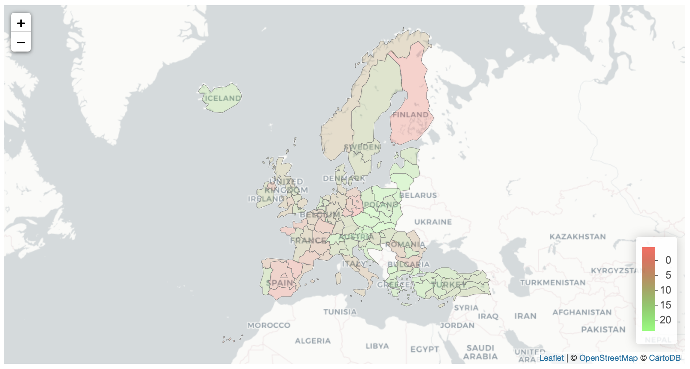
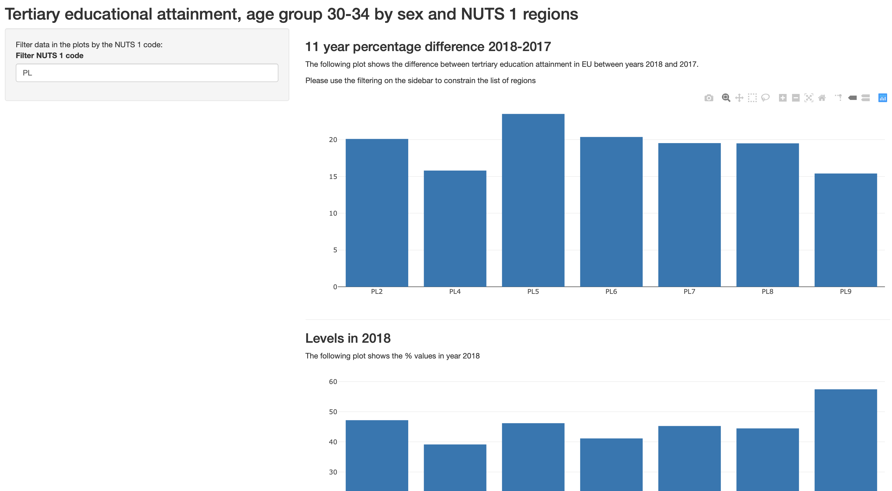

## Intro

```{r echo=FALSE, results='hide', message=FALSE, opts_chunk$set(echo=FALSE,message=FALSE, results='hide')}
library(tidyverse)
library(leaflet)
library(eurostat)
library(janitor)
library(knitr)
library(kableExtra)
library(magrittr)
library(geojsonio)
library(spdplyr)
library(glue)

geo_file <- 'NUTS_RG_60M_2016_4326_LEVL_1.geojson'
geo_zip <- 'map.zip'

if(!file.exists(geo_file)) {
  download.file(
    'https://ec.europa.eu/eurostat/cache/GISCO/distribution/v2/nuts/download/ref-nuts-2016-60m.geojson.zip',
    destfile=geo_zip
  )
  unzip(geo_zip)
}

maps <- geojson_read(geo_file, what="sp")
maps$NUTS_ID <- as.character(maps$NUTS_ID)

edu.data <- get_eurostat(id='tgs00105')
edu.data %>% glimpse
edu.data %>% summary

edu.data %<>% filter(time == "2007-01-01" | time == "2018-01-01") %>%
  select(-unit, -isced11, -age) %>%
  group_by(geo, time) %>%
  summarise(values=mean(values, na.rm = TRUE)) %>%
  ungroup %>%
  spread(time, values) %>%
  mutate(diff=.[["2018-01-01"]] - .[["2007-01-01"]]) %>%
  drop_na() %>%
  mutate(nuts_id=as.character(geo)) %>%
  select(-geo) %>%
  filter(nuts_id %in% maps$NUTS_ID)

maps <- maps[maps$NUTS_ID %in% edu.data$nuts_id, ]
maps <- maps[match(edu.data$nuts_id, maps$NUTS_ID), ]

edu.data %>%
  arrange(nuts_id) %>%
  kable %>%
  kable_styling(bootstrap_options = c("striped", "hover", "condensed", "responsive")) %>%
  scroll_box(width = "100%", height = "400px")
```

Eurostat is the source of lots of data for the EU countries. The assignment
Shiny app allows to easily explore the tetriary education level assignment
accross Union's countries.

---

## Data

Here's how the from Eurostat looks like:

```{r map, echo=FALSE}
edu.data %>%
  head(12) %>%
  kable()
```

---

## Map

```{r, fig.cap="map", out.width = '100%', echo=FALSE}

```

---

## App UI

```{r, fig.cap="ui", out.width = '100%', echo=FALSE}

```
